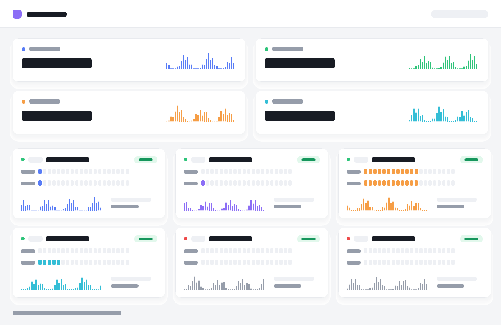

# Nebula

> 浅色像素方块风 · 干净不刺眼 · monitor 状态面板主题



Nebula 是 [monitor](https://github.com/monitor-probe/monitor) 的第三方主题，基于 [monitor-theme-default](https://github.com/monitor-probe/monitor-theme-default) 改造。

柔和灰底 + 纯白卡片，20 格像素方块进度条，方块波形迷你图，蓝紫橙青四色体系，深色模式自动适配。

## 特性

### 🖥 节点卡片
- 状态点 + 国家代码标签 + 节点名 + 备注胶囊
- 右上角到期天数彩色小框（红 ≤7 天 / 黄 ≤30 天 / 绿 >30 天）
- CPU / 内存 / 磁盘 / Swap 方块条，带真实用量小字（如 `3.54 / 15.62 GB`）
- CPU 下方 load 1/5/15 分钟小字
- 上下行速率方块波形迷你图 + 日用量统计
- 流量用量条（有限流量按百分比亮粉格，无限流量全亮 + `∞`）
- 线路探测：12 格延迟色带（每格 1 小时，绿<80ms / 黄<150ms / 橙<250ms / 红≥250ms）
- 探测区固定高度，超出可滚动 + 渐隐提示

### 📊 主面板
- 桌面 2 列统计卡：实时网速 / 节点在线 / 最忙节点 / 总流量
- 手机端 3 秒自动淡入轮播，不可手动滑动
- WebSocket 每 2 秒推送，断线 2 秒轮询 + 3 秒自动重连

### 📈 详情页
- 圆角卡片框包住 Tab 切换 + 时间范围 + 图表
- 资源 Tab：CPU / 内存 / 网络速率 / 磁盘历史折线图
- 网络延迟 Tab：多探测折线图 + 削峰滤波 + 断点连线 + Brush 缩放
- 探测节点筛选 chips，丢包率直接标在标签上

### ✨ 细节
- 等宽数字（tabular-nums），数字跳动不晃
- 分隔线区分资源 / 网络 / 线路三个区块
- 备注标签渐变胶囊，紧跟节点名
- 懒加载详情页，首屏只加载列表
- 坏数据自动隔离，一个节点上报异常不会清空全页

## 快速开始

```bash
npm install
npm run dev
```

构建：

```bash
npm run build
tar --format=ustar -czf theme.tar.gz dist theme.json preview.png
```

## 主题契约

同 [monitor-theme-default](https://github.com/monitor-probe/monitor-theme-default)：

| 接口 | 说明 |
|------|------|
| `GET /api/me` | 站点名、登录状态、公开页开关 |
| `GET /api/nodes` | 节点列表、实时指标和累计流量 |
| `GET /api/nodes/{id}/metrics` | 历史指标和延迟记录 |
| `GET /api/ws` | 每 2 秒推送节点快照 |

详情页路由：`/node/{id}`

## 技术栈

React 19 · Vite · Tailwind CSS 4 · shadcn/ui · Recharts

## 许可

MIT
